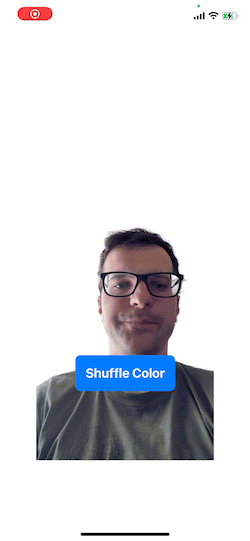

# CoreML Camera Video Matting

This is a simple iOS app which applies Video Matting (background removal) model to the front camera stream. Video Matting is performed using pre-trained CoreML model from (Robust Video Matting project)[https://github.com/PeterL1n/RobustVideoMatting].

App is implemented using SwiftUI. Also (Mac Catalyst)[https://developer.apple.com/mac-catalyst/] was used to port the app to MacOS.

## Launch instructions

Tested using the following environment:
1) Xcode Version 13.2.1 (13C100)
2) 1.26.21 Apple Swift version 5.5.2

The project doesn't require any external dependencies or resources so just pull the repo and open the project in Xcode.

<b>NOTE:</b> since the app uses camera, it won't work in emulator - you need a <b>PHYSICAL</b> iOS/MacOS device to run it.

